# Startup Productivity Platform (AWS)

[](https://opensource.org/licenses/MIT)
[](https://aws.amazon.com/eks/)
[](https://kubernetes.io/)
[](https://www.terraform.io/)
[](https://helm.sh/)
[](https://www.ansible.com/)

> **⚠️ Portfolio Project Notice**: This is demonstration code showcasing infrastructure architecture and deployment patterns. Values and secrets are placeholders - not intended for production deployment without proper configuration.

A complete self-hosted SaaS productivity suite deployed on Amazon Elastic Kubernetes Service (EKS) with subdomain routing. This platform provides startups and small businesses with essential business applications including LMS, file storage, CRM, HR management, and email services.

## 🚀 Features

### Core Applications
- **📚 Moodle** - Learning Management System for training and education
- **☁️ Nextcloud** - Secure file storage and collaboration platform
- **🤝 SuiteCRM** - Customer Relationship Management system
- **👥 OrangeHRM** - Human Resource Management solution
- **📧 Roundcube** - Modern webmail client

### Infrastructure Highlights
- **Amazon EKS** - Managed Kubernetes service for scalable container orchestration
- **Subdomain Routing** - Clean URLs for each application via AWS ALB Ingress
- **SSL/TLS Termination** - Automatic certificate management with AWS Certificate Manager
- **Infrastructure as Code** - Reproducible deployments with Terraform
- **Application Management** - Helm charts deployed via Ansible automation
- **High Availability** - Multi-AZ deployment across AWS regions

## 🏗️ Architecture

```mermaid
graph TB
    subgraph "AWS Cloud Infrastructure"
        subgraph "DNS & CDN"
            Route53[Route 53<br/>DNS Management]
            CloudFront[CloudFront<br/>CDN & Edge Locations]
            ACM[AWS Certificate Manager<br/>SSL/TLS Certificates]
        end
        
        subgraph "Network Layer"
            VPC[VPC<br/>10.0.0.0/16]
            PublicSubnet1[Public Subnet AZ-1<br/>10.0.1.0/24]
            PublicSubnet2[Public Subnet AZ-2<br/>10.0.2.0/24]
            PrivateSubnet1[Private Subnet AZ-1<br/>10.0.10.0/24]
            PrivateSubnet2[Private Subnet AZ-2<br/>10.0.20.0/24]
            IGW[Internet Gateway]
            NAT1[NAT Gateway AZ-1]
            NAT2[NAT Gateway AZ-2]
        end
        
        subgraph "Load Balancing"
            ALB[Application Load Balancer<br/>Layer 7 Routing]
            NLB[Network Load Balancer<br/>Layer 4 Load Balancing]
        end
        
        subgraph "EKS Cluster"
            EKS[Amazon EKS<br/>Kubernetes Control Plane]
            SystemNodes[System Node Group<br/>t3.medium]
            AppNodes[Application Node Group<br/>t3.large]
            SpotNodes[Spot Instance Node Group<br/>Cost Optimization]
        end
        
        subgraph "Business Applications"
            Moodle[📚 Moodle LMS<br/>moodle.domain.com]
            Nextcloud[☁️ Nextcloud<br/>files.domain.com]
            SuiteCRM[🤝 SuiteCRM<br/>crm.domain.com]
            OrangeHRM[👥 OrangeHRM<br/>hr.domain.com]
            Roundcube[📧 Roundcube<br/>mail.domain.com]
        end
        
        subgraph "Container & Storage"
            ECR[Amazon ECR<br/>Container Registry]
            EFS[Amazon EFS<br/>Shared File System]
            EBS[Amazon EBS<br/>Block Storage]
            S3[Amazon S3<br/>Object Storage]
        end
        
        subgraph "Database Layer"
            RDS[Amazon RDS<br/>PostgreSQL Multi-AZ]
            ElastiCache[Amazon ElastiCache<br/>Redis Caching]
        end
        
        subgraph "Security & Secrets"
            SecretsManager[AWS Secrets Manager<br/>Application Secrets]
            ParameterStore[Systems Manager<br/>Parameter Store]
            KMS[AWS KMS<br/>Encryption Keys]
            IAM[AWS IAM<br/>Access Management]
        end
        
        subgraph "Monitoring & Logging"
            CloudWatch[CloudWatch<br/>Metrics & Alarms]
            CloudTrail[CloudTrail<br/>API Audit Logs]
            XRay[AWS X-Ray<br/>Distributed Tracing]
            GuardDuty[GuardDuty<br/>Threat Detection]
        end
        
        subgraph "DevOps & Automation"
            CodePipeline[AWS CodePipeline<br/>CI/CD Pipeline]
            CodeBuild[AWS CodeBuild<br/>Build Service]
            Terraform[Terraform<br/>Infrastructure as Code]
            Ansible[Ansible<br/>Application Deployment]
        end
    end
    
    subgraph "External Access"
        Users[👥 End Users]
        Admins[👨‍💼 System Administrators]
        Developers[👨‍💻 DevOps Engineers]
    end
    
    %% User Traffic Flow
    Users --> Route53
    Route53 --> CloudFront
    CloudFront --> ALB
    ALB --> EKS
    
    %% Application Routing
    EKS --> Moodle
    EKS --> Nextcloud
    EKS --> SuiteCRM
    EKS --> OrangeHRM
    EKS --> Roundcube
    
    %% Infrastructure Dependencies
    EKS --> ECR
    EKS --> EFS
    EKS --> EBS
    EKS --> S3
    EKS --> RDS
    EKS --> ElastiCache
    EKS --> SecretsManager
    
    %% DevOps Flow
    Developers --> CodePipeline
    CodePipeline --> CodeBuild
    CodeBuild --> ECR
    CodeBuild --> EKS
    Terraform --> EKS
    Ansible --> EKS
    
    %% Monitoring Flow
    EKS --> CloudWatch
    EKS --> XRay
    CloudTrail --> S3
    GuardDuty --> CloudWatch
    
    %% Network Flow
    IGW --> PublicSubnet1
    IGW --> PublicSubnet2
    NAT1 --> PrivateSubnet1
    NAT2 --> PrivateSubnet2
    VPC --> EKS

    %% Styling
    classDef aws fill:#FF9900,stroke:#fff,stroke-width:2px,color:#fff
    classDef apps fill:#28a745,stroke:#fff,stroke-width:2px,color:#fff
    classDef storage fill:#fd7e14,stroke:#fff,stroke-width:2px,color:#fff
    classDef security fill:#dc3545,stroke:#fff,stroke-width:2px,color:#fff
    classDef monitoring fill:#6f42c1,stroke:#fff,stroke-width:2px,color:#fff
    classDef users fill:#17a2b8,stroke:#fff,stroke-width:2px,color:#fff
    
    class Route53,CloudFront,VPC,EKS,ALB,NLB aws
    class Moodle,Nextcloud,SuiteCRM,OrangeHRM,Roundcube apps
    class ECR,EFS,EBS,S3,RDS,ElastiCache storage
    class SecretsManager,KMS,IAM,GuardDuty security
    class CloudWatch,CloudTrail,XRay monitoring
    class Users,Admins,Developers users
```



## 🛠️ Technology Stack

| Component | Technology | Purpose |
|-----------|------------|---------|
| **Infrastructure** | Terraform | Infrastructure as Code |
| **Orchestration** | Amazon EKS | Managed Kubernetes service |
| **Application Deployment** | Helm + Ansible | Automated application management |
| **Container Registry** | Amazon ECR | Docker image storage |
| **Load Balancing** | AWS Application Load Balancer | Layer 7 load balancing and SSL termination |
| **DNS** | Amazon Route 53 | Domain management and health checks |
| **CDN** | Amazon CloudFront | Content delivery and caching |
| **Database** | Amazon RDS | Managed PostgreSQL/MySQL |
| **Caching** | Amazon ElastiCache | Redis in-memory caching |
| **Storage** | Amazon EFS/EBS/S3 | File, block, and object storage |
| **Secrets** | AWS Secrets Manager | Secure credential management |
| **Monitoring** | AWS CloudWatch | Metrics, logs, and alerting |

## 📋 Prerequisites

- AWS CLI v2 installed and configured
- Terraform >= 1.0 installed
- kubectl installed
- Helm 3.x installed
- Ansible >= 2.9 installed
- AWS account with appropriate IAM permissions
- Domain name for subdomain routing

## 🚀 Quick Start

> **⚠️ Important**: This is portfolio/demonstration code. Before deployment:
> - Replace all placeholder values in `terraform.tfvars`
> - Update secrets in `secrets/` directory
> - Configure your domain and SSL certificates
> - Review and adjust resource sizing for your needs

### 1. Clone the Repository
```bash
git clone https://github.com/sat0ps/startup-saas-aws.git
cd startup-saas-aws
```

### 2. Configure Terraform Variables
```bash
# Copy and edit the configuration file
cp terraform/terraform.tfvars.example terraform/terraform.tfvars

# Edit with your specific values
vim terraform/terraform.tfvars
```

### 3. Deploy Infrastructure
```bash
cd terraform

# Initialize Terraform
terraform init

# Plan the deployment
terraform plan

# Apply the infrastructure
terraform apply
```

### 4. Configure kubectl
```bash
# Update kubeconfig for EKS cluster
aws eks update-kubeconfig --region us-west-2 --name startup-saas-eks
```

### 5. Deploy Applications with Ansible
```bash
cd ../ansible

# Install required Ansible collections
ansible-galaxy install -r requirements.yml

# Deploy all applications
ansible-playbook -i inventory/production playbooks/deploy-all.yml
```

### 6. Configure DNS
```bash
# Get ALB DNS name
kubectl get ingress -A

# Create Route 53 records pointing to ALB
# (This can be automated in Terraform)
```

## 📁 Project Structure

```
startup-saas-aws/
├── terraform/                   # Infrastructure as Code
│   ├── main.tf                 # Main Terraform configuration
│   ├── variables.tf            # Input variables
│   ├── outputs.tf              # Output values
│   ├── modules/                # Reusable Terraform modules
│   │   ├── vpc/               # VPC and networking
│   │   ├── eks/               # EKS cluster configuration
│   │   ├── rds/               # Database setup
│   │   └── monitoring/        # CloudWatch and logging
│   └── environments/          # Environment-specific configs
│       ├── dev/
│       ├── staging/
│       └── prod/
├── ansible/                    # Application deployment
│   ├── playbooks/             # Ansible playbooks
│   │   ├── deploy-all.yml     # Deploy all applications
│   │   └── app-specific/      # Individual app deploybooks
│   ├── roles/                 # Ansible roles
│   │   ├── moodle/           # Moodle deployment role
│   │   ├── nextcloud/        # Nextcloud deployment role
│   │   ├── suitecrm/         # SuiteCRM deployment role
│   │   ├── orangehrm/        # OrangeHRM deployment role
│   │   └── roundcube/        # Roundcube deployment role
│   ├── inventory/             # Ansible inventory
│   └── group_vars/            # Group variables
├── helm/                      # Helm charts and values
│   ├── charts/               # Custom Helm charts
│   └── values/               # Environment-specific values
│       ├── moodle/
│       ├── nextcloud/
│       ├── suitecrm/
│       ├── orangehrm/
│       └── roundcube/
├── scripts/                   # Utility scripts
│   ├── deploy.sh             # Main deployment script
│   ├── destroy.sh            # Cleanup script
│   └── backup.sh             # Backup automation
├── monitoring/                # Monitoring configuration
│   ├── grafana/              # Grafana dashboards
│   ├── prometheus/           # Prometheus configs
│   └── alerts/               # Alert manager rules
└── docs/                     # Documentation
    ├── DEPLOYMENT.md         # Detailed deployment guide
    ├── CONFIGURATION.md      # Configuration reference
    ├── MONITORING.md         # Monitoring setup
    └── TROUBLESHOOTING.md    # Common issues and solutions
```

## ⚙️ Configuration

### Terraform Variables
Key configuration in `terraform/terraform.tfvars`:

```hcl
# Basic Configuration
project_name = "startup-saas"
environment  = "production"
region      = "us-west-2"

# EKS Configuration
cluster_version = "1.28"
node_groups = {
  system = {
    instance_types = ["t3.medium"]
    min_size      = 1
    max_size      = 3
    desired_size  = 2
  }
  applications = {
    instance_types = ["t3.large"]
    min_size      = 2
    max_size      = 10
    desired_size  = 3
  }
}

# Database Configuration
db_instance_class = "db.r6g.large"
db_engine_version = "14.9"

# Domain Configuration
domain_name = "yourdomain.com"
```

### Application Configuration
Each application has its own Helm values file in `helm/values/` for customization.

## 🔐 Security Features

- **VPC with private subnets** for EKS worker nodes
- **IAM roles and policies** following least-privilege principle
- **AWS Secrets Manager** integration for sensitive data
- **Network policies** for pod-to-pod communication control
- **AWS Certificate Manager** for automatic SSL certificate management
- **GuardDuty** for threat detection and monitoring
- **CloudTrail** for comprehensive audit logging
- **KMS encryption** for data at rest and in transit

## 📊 Monitoring and Observability

### Built-in AWS Services
- **CloudWatch** for metrics, logs, and alarms
- **CloudWatch Container Insights** for EKS monitoring
- **AWS X-Ray** for distributed tracing
- **VPC Flow Logs** for network analysis

### Optional Add-ons
- **Prometheus** for custom metrics collection
- **Grafana** for advanced dashboards
- **Jaeger** for distributed tracing
- **ELK Stack** for log aggregation and analysis

## 💰 Cost Optimization

- **Spot instances** for non-critical workloads
- **Cluster autoscaler** for dynamic scaling
- **Horizontal Pod Autoscaler** for application scaling
- **S3 lifecycle policies** for storage optimization
- **Reserved instances** recommendations via Cost Explorer
- **AWS Cost and Usage Reports** integration

## 🔧 Maintenance

### Infrastructure Updates
```bash
# Update Terraform modules
terraform get -update

# Plan and apply changes
terraform plan
terraform apply
```

### Application Updates
```bash
# Update Helm charts
helm repo update

# Deploy updated applications
ansible-playbook -i inventory/production playbooks/update-apps.yml
```

### EKS Cluster Updates
```bash
# Update cluster version (via Terraform)
# Update node groups
# Update add-ons
```

## 🐛 Troubleshooting

### Common Issues

**EKS Nodes Not Joining Cluster**
```bash
# Check node group status
aws eks describe-nodegroup --cluster-name startup-saas-eks --nodegroup-name system

# Check CloudFormation events
aws cloudformation describe-stack-events --stack-name eksctl-startup-saas-eks-nodegroup-system
```

**Pods Stuck in Pending State**
```bash
kubectl describe pod <pod-name> -n <namespace>
# Check for resource constraints, node affinity, or PVC issues
```

**ALB Ingress Not Working**
```bash
# Check AWS Load Balancer Controller logs
kubectl logs -n kube-system deployment/aws-load-balancer-controller

# Verify ingress annotations
kubectl describe ingress <ingress-name> -n <namespace>
```

**RDS Connectivity Issues**
```bash
# Check security groups
aws ec2 describe-security-groups --group-ids <rds-sg-id>

# Test connectivity from pod
kubectl run test-pod --image=postgres:13 -it --rm -- psql -h <rds-endpoint>
```

## 📖 Documentation

- [Detailed Deployment Guide](docs/DEPLOYMENT.md)
- [Configuration Reference](docs/CONFIGURATION.md)
- [Monitoring Setup](docs/MONITORING.md)
- [Troubleshooting Guide](docs/TROUBLESHOOTING.md)
- [Security Best Practices](docs/SECURITY.md)
- [Cost Optimization Guide](docs/COST_OPTIMIZATION.md)

## 🤝 Contributing

This is primarily a portfolio project, but contributions for improvements are welcome:

1. Fork the repository
2. Create a feature branch (`git checkout -b feature/amazing-feature`)
3. Commit your changes (`git commit -m 'Add amazing feature'`)
4. Push to the branch (`git push origin feature/amazing-feature`)
5. Open a Pull Request

## 📄 License

This project is licensed under the MIT License - see the [LICENSE](LICENSE) file for details.

## 🆘 Support

- **Documentation**: Check the [docs/](docs/) directory
- **Issues**: Report bugs via GitHub Issues
- **Discussions**: Use GitHub Discussions for questions

## 🎯 Roadmap

- [ ] GitOps integration with ArgoCD
- [ ] Service mesh implementation with Istio
- [ ] Multi-region deployment support
- [ ] Advanced monitoring with Prometheus/Grafana
- [ ] Disaster recovery automation
- [ ] Integration with AWS SSO
- [ ] Serverless functions integration
- [ ] Advanced security scanning pipeline

## ⚠️ Important Notes

**Portfolio Project Disclaimer:**
- This code demonstrates infrastructure patterns and deployment strategies
- Values and secrets are placeholders for security
- Production deployment requires proper configuration of:
  - Domain names and SSL certificates
  - Database credentials and connection strings
  - Application-specific configuration
  - Resource sizing based on actual requirements
  - Backup and disaster recovery procedures

## ⭐ Acknowledgments

- AWS EKS team for excellent documentation
- Terraform AWS provider maintainers
- Helm and Ansible communities
- Open source projects: Moodle, Nextcloud, SuiteCRM, OrangeHRM, Roundcube

---

**Built for demonstration of AWS cloud-native architecture patterns** 🚀
